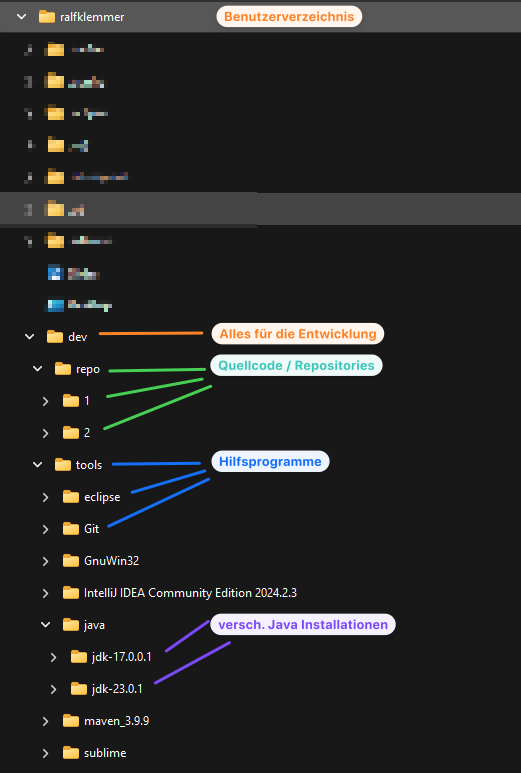
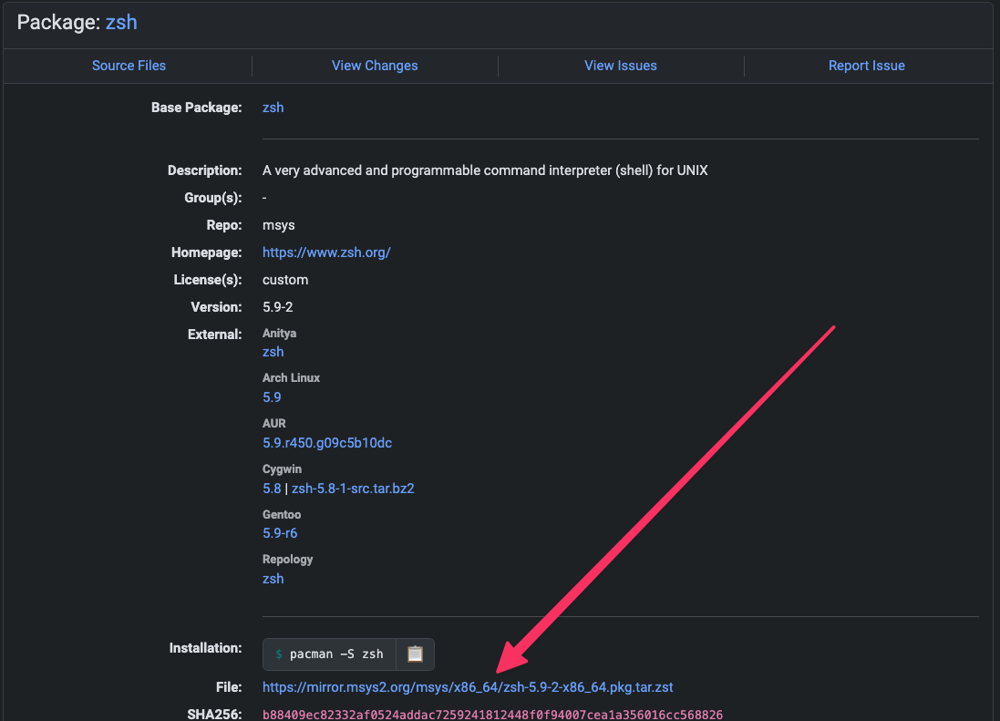

# Windows 11: Installation von Git Bash mit ZSH, oh-my-zsh und powerlevel10k

## Begleitvideo zu dieser Anleitung
:movie_camera: [Video - Windows 11: Git Bash und oh-my-zsh installieren](https://youtu.be/aqukKyAES7o)

## :warning: Installationsverzeichnise und Struktur auf deinem Rechner
Auf vielen Rechnern sind die Rechte eingeschränkt, um dennoch eine lauffähige Entwicklungsumgebung zu installieren, werden wird alles unter dem Windows Benutzerordern installieren. Hier haben wir immer die Rechte, die wir benötigen.

>In aktuellen Versionen von Windows, die auf dem Mehrbenutzersystem der Windows-NT-Linie basieren, hat jeder Benutzer sein eigenes Benutzerverzeichnis. Dieses liegt unter ```C:\Users\benutzername```. benutzername ist dabei die Kennung, unter der sich der Benutzer anmeldet. Users wird dabei im Windows-Explorer in die jeweilige Sprache des Systems übersetzt angezeigt; auf einem deutschen Windows liest man daher Benutzer.

Damit du der Anleitung voll vertrauen kannst, musst die gleich Ordnerstruktur erstellen:</br>


## 1. Git Bash herunterladen & installieren
**Download**: <https://git-scm.com/download/win> </br>
**Installationsordner**: ```C:\Users\benutzername\dev\tools\git``` </br>

> :warning: Bitte unbedingt im Windows Benutzerverzeichnis (```C:\Users\benutzername```) installieren!

## 2. ZSH herunterladen & installieren

### a) Nerd Font herunterladen & installieren (für die spätere Verwendung in Git Bash und oh-my-zsh) </br>
**Download**: <https://github.com/ryanoasis/nerd-fonts/releases/download/v3.1.0/EnvyCodeR.zip> </br>
**Entpacken**: Windows 11 kann zip-Dateien von Haus aus entpacken. Die Dateien mit der Endung ```ttf``` sind besondere Schriftarten, die wir nachher benötigen. </br>
**Installation**: Alle Schriftarten installieren indem du alle markierst, dann die rechte Maustaste und auf _installieren_ gehst. </br>

> :information_source:
Du kannst auch deine deine eigenen Schriftarten auswählen und installieren. Dann musst du aber den in Namen der Schriftart in Schritt 5 in der ```~/.minttyrc``` entsprechend anpassen. </br>
Weitere Nerd Fonts findest du unter <https://www.nerdfonts.com/font-downloads>. 

### b) Lade das neueste zsh-Paket herunter

**Download-Webseite**: <https://packages.msys2.org/package/zsh?repo=msys&variant=x86_64>. 


Beispiel:

```txt
zsh-5.9-2-x86_64.pkg.tar.zst
```
**Entpacken** </br>
Windows 11 kann dies wieder von Haus aus. Solltest es nicht klappen, dann kannst du auch mit dem kostenlosen Tool Peazip die Datei entpacken <https://peazip.github.io/zst-compressed-file-format.html>.

### c) Entpackte Dateien in Git Bash Installationsverzeichnis kopieren
Bitte alle entpackten Datein kopieren und in das Installationsverzeichnises von Git Bash kopieren.
Wenn du dich an die Verzeichnisstruktur gehalten hast, dann ist dies ```C:\Users\benutzername\dev\tools\git```.

### d) Test, ob zsh korrekt installiert wurde
Öffne Git Bash und gib ein:

```bash
zsh
```
Es darf keine Fehlermeldung kommen. Du solltest aber am Ende des Prompts ein ```%```-Zeichen sehen (mit bash haben wir ein ```$```).

:information_source: `zsh` wird einige Konfigurationen abfragen, wie Tab-Vervollständigung, Verlauf usw. Bitte lies die Optionen und passe die Konfiguration an deine Bedürfnisse an.

### 5. Erstelle die `~/.minttyrc` Datei
a) Gib ein: ``` touch .minttyrc ``` (erstellt die leere Datei ```minttyc```)</br>
b) folgenden Inhalt einfügen </br>

```.minttyrc
BoldAsFont=no
Font=EnvyCodeR Nerd Font Mono
FontHeight=14
Columns=180
Rows=46
ScrollbackLines=2000
BackgroundColour=13,13,13
MiddleClickAction=void
RightClickAction=paste
Language=
BellType=0
BellFlash=yes
Printer=Microsoft Print to PDF
Transparency=off
CursorBlinks=yes
ThemeFile=nord
ForegroundColour=178,178,178
CursorColour=225,225,225
FontSmoothing=full
Locale=de_DE
Charset=UTF-8
Term=xterm-256color
BoldAsColour=no
CursorType=block
CtrlExchangeShift=yes
```

### 6. Erstelle git-prompt.sh

Um einen Fehlermeldung vorzubeugen, führe den folgenden Befehl aus:

```bash
mkdir -p ~/.config/git && echo "" > ~/.config/git/git-prompt.sh
```

Wir vermeiden dadurch die spätere Fehlermeldung ```ERROR: this script is obsolete, please see git-completion.zsh```

## 3. ZSH konfigurieren

### a) zsh als eigenständige Shell
Der folgende Befehl für din die Datei `zshenv` eine Zeile hinzu. Daher nur einmal ausführen! Bei Problemen könnt ihr die Datei löschen, sie wird durch den Befehl neu erstellt.

Falls du Admin-Rechte auf deinem Rechner hast - diesen Befehl in der Git Bash ausführen:
```bash
sudo sed -i '1iPATH=/mingw64/bin:/usr/bin:/usr/bin:/bin:$PATH' /etc/zsh/zshenv
```
Ohne Admin-Rechte:
```bash
sed -i '1iPATH=/mingw64/bin:/usr/bin:/usr/bin:/bin:$PATH' /etc/zsh/zshenv
```

### b) In `~/.bashrc` auf zsh Shell umleiten

Füge folgende Zeilen am Ende der Datei hinzu:

```bash
echo '# Launch Zsh
if [ -t 1 ]; then
exec zsh
fi' >> ~/.bashrc
```

### c) ZSH als Standard-Shell beim Start von Git Bash konfigurieren

Füge folgende Zeilen am Ende der Datei ```C:\Users\benutzername\dev\tools\git\etc\bash.bashrc``` hinzu:

```bash
# Get user bash configuration ~/.bashrc
source ~/.bashrc;
```

:fast_forward: Schließe und öffne Git Bash erneut

## 4. Zsh Plugins installieren
Wir installieren: zsh-autosuggestions & zsh-syntax-highlighting

**Download**: 

```bash
git clone https://github.com/zsh-users/zsh-autosuggestions $ZSH/plugins/zsh-autosuggestions && git clone https://github.com/zsh-users/zsh-syntax-highlighting.git $ZSH/plugins/zsh-syntax-highlighting
```
    
**Installation**:    

```bash
source $ZSH/plugins/zsh-autosuggestions/zsh-autosuggestions.zsh && source $ZSH/plugins/zsh-syntax-highlighting/zsh-syntax-highlighting.zsh
```

3. Bearbeite die `~/.zshrc` Datei
Die aufgeführten Plugins in die Sektion ```plugins``` einfügen. Falls die Sektion nicht vorhanden ist, dann den foglenden Ausdruck komplett einfügen:
```zshrc
plugins=( 
  zsh-autosuggestions
  zsh-syntax-highlighting
)
```

## 5. Oh-my-zsh installieren
Die Oh-My-Zsh Installation erwartet einen zip-Befehl wie unter Linux. 

**a) Vorarbeit** </br>
GNUzip herunterladen und installieren ```<https://gnuwin32.sourceforge.net/packages/zip.htm>```(Complete Paket). 
Gerne unter ```C:\Users\benutzername\dev\tools\zip``` </br>

**b) Download und Installation von Oh-My-Zsh** </br>
Führe den folgenden Befehl in Git Bash aus

```bash
sh -c "$(curl -fsSL https://raw.githubusercontent.com/ohmyzsh/ohmyzsh/master/tools/install.sh)"
```

## 6. Theme Powerlevel10k installieren** </br>

**a) Download und Installation**: </br>
Führe den folgenden Befehl in Git Bash aus

```bash
git clone --depth=1 https://github.com/romkatv/powerlevel10k.git ${ZSH_CUSTOM:-$HOME/.oh-my-zsh/custom}/themes/powerlevel10k
```

**b) Standard-Theme festlegen**
1. Bearbeite die `~/.zshrc` Datei
2. Suche die Variable ```ZSH_THEME``` und ändere die Zeile zu ```ZSH_THEME="powerlevel10k/powerlevel10k"```

**c) Git Bash neu starten**

**d) p10k Konfigurations-Assistent startet**
Führe den Assistenten aus und konfiguriere das Aussehen wie es dir gefällt.

## 7. Git Bash neu starten

