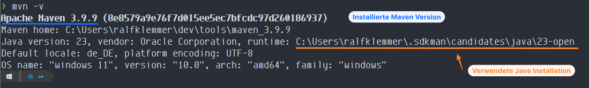

# Java und Maven Installation

Video zu dieser Anleitung: :movie_camera: [Video - Windows 11: Java und Maven installieren](https://youtu.be/g1GmP9uFuMw)


## Java
1. Ein Java JDK (Java Development Kit) herunterladen. Z.B.: von [jdk.java.net](https://jdk.java.net/).
2. Zip entpacken und an einen gewünscheten Ort kopieren z.B. C:\Users\benutzername\dev\tools\java\java23.
3. Benutzer-Umgebungsvariable anpassen
JAVA_HOME hinzufügen: Eintrag lautet JAVA_HOME="C:\Users\myname\dev\tools\java\java23"
Path anpassen: Eintrag %JAVA_HOME%\bin hinzufügen
4. Testen, ob Java korrekt installiert wurde
Eine neue Eingabeaufforderung oder Git Bash aufmachen und folgenden Befehle ausführen:

```
java -version
```

Die gerade konfigurierte Java Version sollte angezeigt werden.

## Maven
1. [Maven heruntenladen](https://maven.apache.org/download.cgi)
2. Zip entpacken und an einen gewünscheten Ort kopieren z.B. C:\Users\benutzername\dev\tools\maven
3. Benutzer-Umgebungsvariable anpassen
MAVEN_HOME hinzufügen: Eintrag lautet MAVEN_HOME="C:\Users\myname\dev\tools\maven"
Path anpassen: Eintrag %M2_HOME%\bin hinzufügen
4. Testen, ob Maven korrekt installiert wurde
Eine neue Eingabeaufforderung oder Git Bash aufmachen und folgenden Befehle ausführen:

```
mvn -v
```

Jetzt sollte die Maven Version und die verwendete Java Version angezeigt werden.
Das sollte in etwa so aussehen, die Pfade sind bei mir anders als bei euch.


## Java Version wechseln
Für einen Wechsel muss die JAVA_HOME auf eine andere Java-Installation umgestellt werden.
